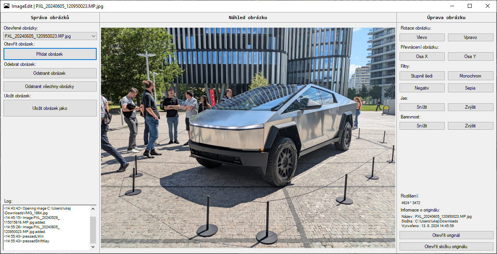

# ImageEdit

Desktopová aplikace pro správu, úpravu a prohlížení obrázků.

## Možnosti úprav

- Rotace obrázku
- Převrácení obrázku
- Aplikování filtrů (grayscale, monochrom, negativ, sépie)
- Úprava jasu
- Úprava saturace

## Screenshot aplikace

## Použité technologie a nástroje

Programovací jazyk C#, framework WPF, Visual Studio
